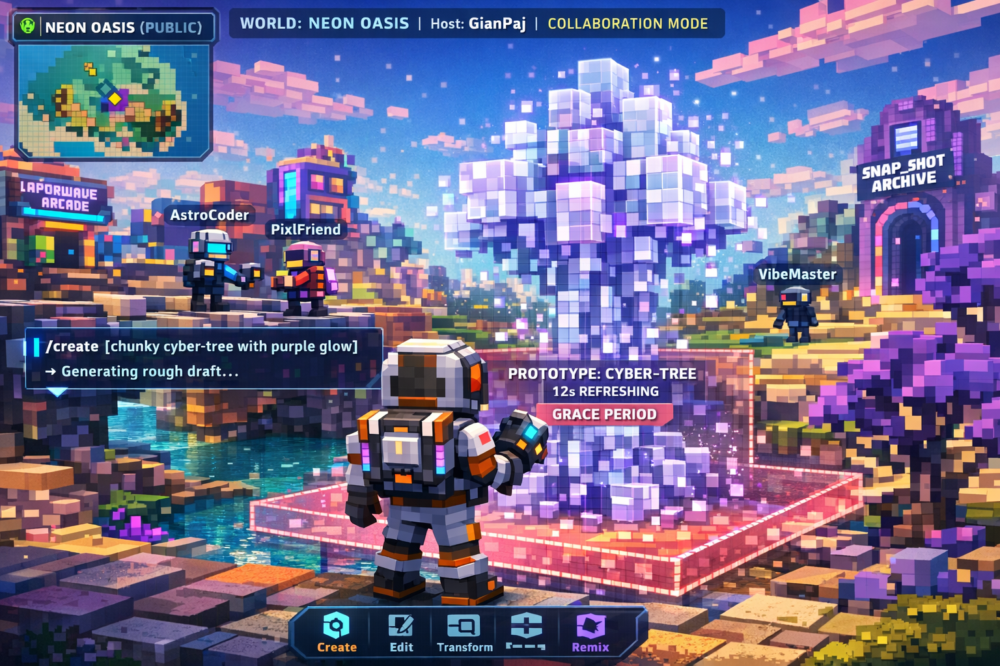
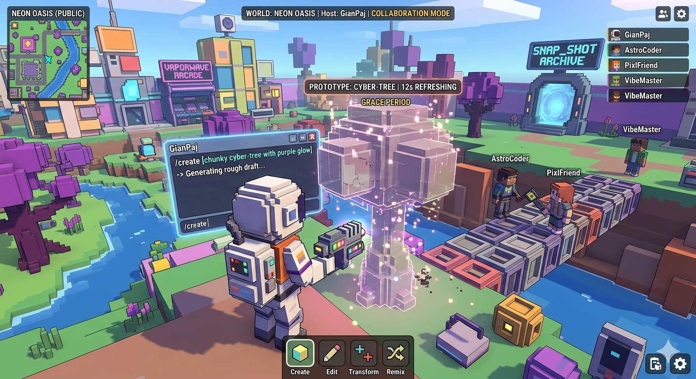
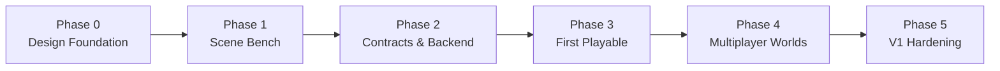

# Vibe World

This folder is the current design and early implementation-spec bundle for Vibe World: a multiplayer, prompt-first, voxel-native social sandbox where players create and remix chunky 3D worlds in real time.

## Current status

The project has moved beyond loose brainstorming and now sits between design definition and early implementation.

So far, Vibe World has:

- a documented V1 product and systems direction across the design/spec files in this folder
- a concrete multiplayer backend choice: `SpacetimeDB`
- a concrete AI generation direction: external worker/service
- a defined V1 editing scope: spawned objects only
- a defined V1 world model: both public and private worlds
- a first implementation artifact: the `prototype/scene-planning-bench/` scene bench prototype for evaluating scene-planning outputs against strict schemas, prompt bundles, deterministic scorers, and Inspect-backed execution logs
- a second implementation artifact: the `prototype/scene-builder-bench/` builder benchmark scaffold for validating deterministic object-builder specs from normalized scene plans

The current V1 decisions are:

- multiplayer backend: `SpacetimeDB`
- AI generation: external worker/service
- V1 editing scope: spawned objects only
- V1 world types: both public and private
- public worlds: non-destructive remixing
- private worlds: destructive edits may be enabled
- player identity: anonymous temporary nicknames
- target room size: about 20 concurrent players

## Recommended reading order

If you want the fastest path from concept to implementation context, read:

1. `01-product-vision.md`
2. `02-core-game-rules.md`
3. `04-object-and-creation-system.md`
4. `05-technical-architecture.md`
5. `prototype-v1-scope.md`
6. `spacetimedb-v1-schema.md`
7. `object-state-machine.md`
8. `prompt-ir-spec.md`
9. `scene-runtime-module-design.md`
10. `scene-runtime-extraction-plan.md`
11. `scene-runtime-typescript-port-plan.md`
12. `world-settings-schema.md`
13. `public-world-permission-matrix.md`

## Concept Art & Visualizations

### First-Person View (Grace Period UI) — ChatGPT

**Scene:** Player using `/create` command to build a chunky cyber-tree. Multiple collaborators (AstroCoder, PixelFriend, VibeMaster) visible in shared world. UI shows generation phase, grace period countdown, and multiplayer overlay.

### Overhead Collaborative View — Gemini 3.0 Pro

**Scene:** Third-person over-the-shoulder view of "GianPaj" actively creating in the "Neon Oasis" world. Shows grace period mechanics, holographic UI panel, multiple collaborating players (AstroCoder, PixlFriend, VibeMaster), and the vibrant voxel environment with the snapshot archive.

**Prompt Details:** See [`image-prompts.md`](image-prompts.md) for the full AI generation prompts used to create these visualizations.

## Document structure

### Concept and product shape

- `01-product-vision.md` — product thesis, fantasy, pillars, and player fantasy
- `03-worlds-hosting-and-governance.md` — world model, host powers, presets, and persistence framing
- `06-research-landscape-3d-voxel-ai.md` — external research and technology landscape

### Rules and gameplay

- `02-core-game-rules.md` — public/private rules, editing, resets, and archive behavior
- `04-object-and-creation-system.md` — object philosophy, grace periods, prompt-first creation, and object grammar

### Architecture and V1 implementation specs

- `05-technical-architecture.md` — authoritative multiplayer stack, object lifecycle, and AI pipeline
- `07-open-questions-and-next-steps.md` — roadmap notes and remaining open design questions
- `prototype-v1-scope.md` — high-level scope and phased implementation plan for the first playable
- `spacetimedb-v1-schema.md` — first multiplayer schema and reducer boundary proposal
- `object-state-machine.md` — authoritative live object lifecycle
- `prompt-ir-spec.md` — first constrained prompt intermediate representation
- `scene-runtime-module-design.md` — reusable runtime module boundary from AI worker through validation, normalization, and render draft output
- `scene-runtime-extraction-plan.md` — staged implementation plan for carving the shared runtime layer out of the benchmark package
- `scene-runtime-typescript-port-plan.md` — staged plan for a TypeScript consumer port and React Three Fiber demo while Python stays source of truth
- `world-settings-schema.md` — host-configurable world settings for V1
- `public-world-permission-matrix.md` — action-by-role permission model for public/private/archive contexts
- `reducer-api-spec.md` — first high-level reducer surface for the authoritative backend
- `ai-worker-contract.md` — request/response boundary for the external AI generation service
- `client-interaction-model.md` — first player-facing interaction flow for the live client
- `archive-ux-spec.md` — first archive-mode experience and read-only memory presentation spec

### Support files

- `image-prompts.md` — prompts used to generate concept images
- `AGENTS.md` — local guidance for future agents and implementation work

## Roadmap

### Phase diagram

### Phase 0 — Design foundation

**Status:** done

This phase established the core shape of the project.

- Product vision, world rules, object model, and architecture direction are documented.
- Core V1 decisions are made for backend, AI boundaries, editing scope, and public/private world behavior.
- The repo has moved beyond brainstorming into structured design and implementation planning.

### Phase 1 — Scene bench prototype

**Status:** in progress

This is where the project is today.

- The current implementation wedge is `prototype/scene-planning-bench/`.
- It benchmarks scene-planning outputs against strict schemas, prompt bundles, deterministic scorers, and Inspect-backed execution logs.
- The goal of this phase is to validate prompt/spec approaches before building the full multiplayer loop.

### Phase 2 — Contracts and backend

**Goal:** lock the machine-readable interfaces and authoritative rules

- Finalize the scene-planning contract, schemas, and scoring criteria.
- Extract the reusable runtime layer that sits between AI worker output and the first live renderer.
- Define the AI worker boundary that can reliably consume planning outputs.
- Finalize the first `SpacetimeDB` schema, reducer surface, and object lifecycle rules.

### Phase 3 — First playable

**Goal:** get the first end-to-end creation loop working

- Connect client actions to authoritative world state.
- Wire AI-assisted object creation into the backend flow.
- Add the first in-world grace-period editing flow for spawned objects only.

### Phase 4 — Multiplayer worlds

**Goal:** turn the prototype loop into a real shared-world experience

- Add basic public/private world configuration behavior.
- Implement permission behavior aligned with the current rules docs.
- Validate room behavior and collaboration flow in small multiplayer sessions.

### Phase 5 — V1 hardening

**Goal:** make the system stable enough for a stronger V1 milestone

- Test toward the target of about 20 concurrent players per room.
- Improve generation quality, latency, and reliability of the external AI worker/service.
- Iterate on archive, remix, moderation, and host-governance systems.
- Prepare the jump from benchmark-driven infrastructure to a fuller playable V1.

### Prototypes

- `prototype/scene-planning-bench/` — Python benchmark prototype for evaluating plain LLM scene-planning outputs against strict schemas, prompt bundles, deterministic scorers, and Inspect-backed execution logs
- `prototype/scene-builder-bench/` — Python benchmark scaffold for validating deterministic `BuilderSpec` output from normalized scene-plan fixtures

## Snapshot summary

The current concept is:

- Anyone can create a world/server from a 3D template.
- The creator becomes the host and chooses key rule settings.
- Public worlds are collaborative and remixable, but regular players cannot make destructive edits.
- Private worlds can be much more chaotic, including destructive editing.
- The visual identity is intentionally chunky and openly voxel-based.
- Object creation is primarily prompt-driven, with rough drafts appearing first and light transform-based refinement during a fixed grace period.
- Resettable worlds wipe the live version completely, but preserve prior versions as read-only, explorable “time machine” snapshots.

## Research note

The research bundle reflects public materials reviewed on March 22, 2026. The strongest near-term fit is not a single end-to-end text-to-voxel model, but a constrained system where AI produces structured object operations inside a world-native voxel grammar.

## Repository note

The `json-render/` directory is a local reference checkout used for analysis.
It is not part of the Vibe World source of truth and is ignored from version control.

The `prototype/scene-planning-bench/` directory is the first real implementation artifact in this folder.
It exists to benchmark the scene-planning layer described in the design docs without yet building the full multiplayer game.

## HUman notes

- LLM raw output -> parse/validate -> normalized scene plan -> renderer consumes it

### Movement / edits

- when an object is moved nearby do a opacity transition, or ideally a transposition (generate the movements and transports necessary to make the movement)
