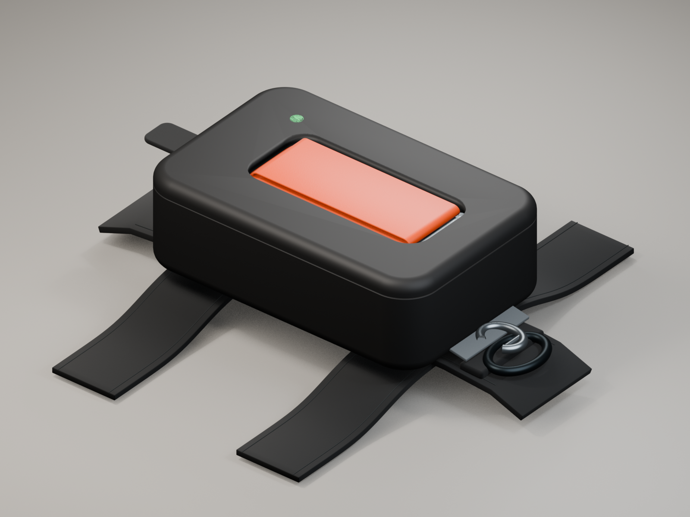

# Wearable leash pod

A 70 × 45 × 22 mm pod clips to the dorsal strap of a dog harness and stores
the leash handle. The leash stays attached to the harness. Pulling the
orange loop along the pod's long axis trips a guided cam and sear. A
latching solenoid acts on the same sear. A rear fabric tab provides a
manual release.

Open [the Blender model](assets/wearable-leash-pod.blend) and choose a scene
from the scene selector. Each scene has its camera assigned.

| Scene         | Camera         | Viewport image                             |
| ------------- | -------------- | ------------------------------------------ |
| `01_Closed`   | `CAM_hero`     | [Closed pod](assets/CAM_hero.png)          |
| `02_Cutaway`  | `CAM_cutaway`  | [Latch cutaway](assets/CAM_cutaway.png)    |
| `03_Released` | `CAM_released` | [Released handle](assets/CAM_released.png) |

[Watch the opening animation](assets/pod-opening.mp4). An axial pull on the
orange loop releases the spring lid and unfolds the webbing. The clip is
five seconds at 24 fps. The [animation project](assets/wearable-leash-pod-opening.blend)
opens in `04_Opening_animation` and includes the three static scenes.

The six root collections are `Pod`, `Latch`, `Leash`, `Harness`, `Lights`,
and `Cameras`. Scene view layers select the matching state. One Blender
unit equals one millimeter. The folded webbing sample is 146.3 mm long and
20 mm wide. The orange handle uses 16 mm ribbon.

This is a product concept model. The latch geometry illustrates the axial
release and lateral guides; it does not validate forces or tolerances.

Rebuild with Blender 5.2 using `build_scene.py`. Run `capture_viewports.py`
inside Blender's UI to save the three camera viewport images.
`animate_opening.py` adds the motion to the static model and saves a
separate project. `export_animation.py` captures its frames for MP4 encoding.
